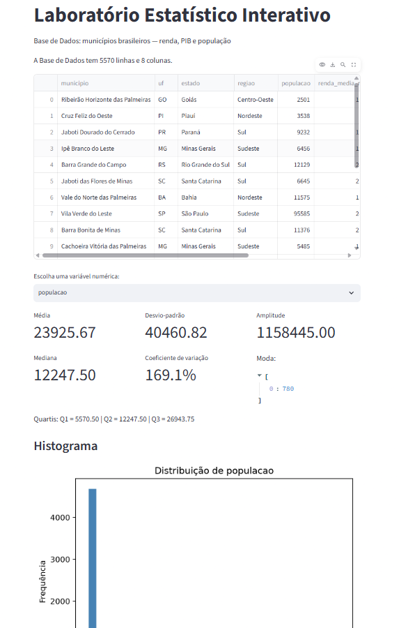
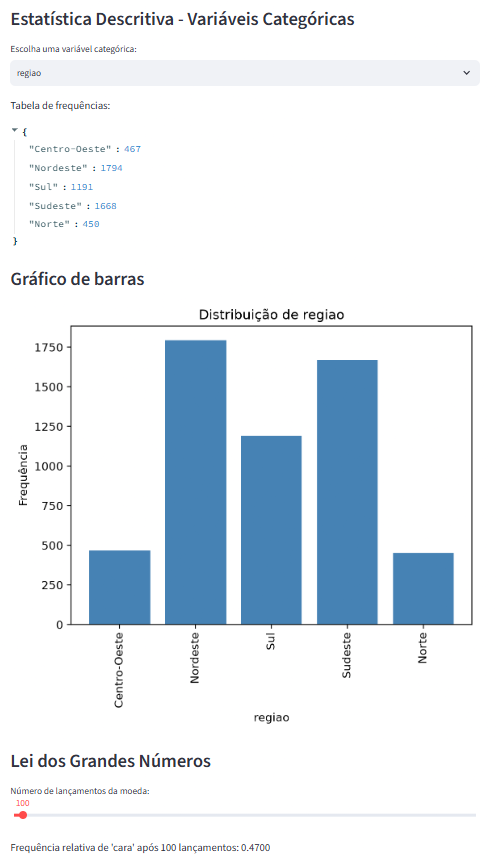
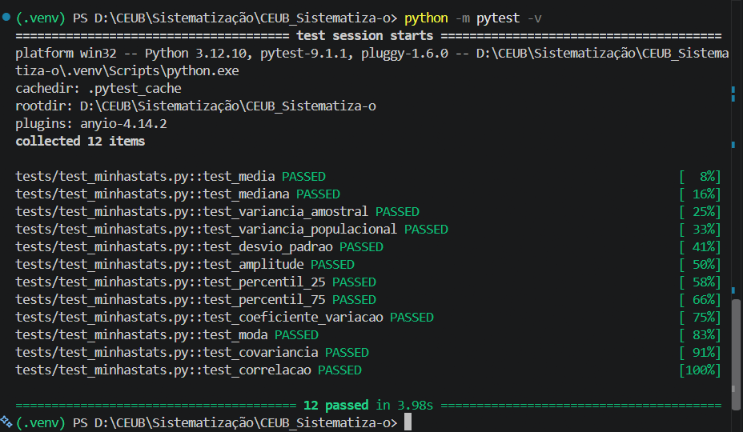

# Laboratório Estatístico Interativo — CEUB Sistematização

Aplicação em Python que implementa, do zero e **sem funções prontas de
estatística**, uma biblioteca própria (`minhastats.py`), validada por testes
automatizados contra NumPy/SciPy, e uma interface interativa em Streamlit para
análise de uma base de dados dos municípios brasileiros.

## Descrição do projeto

A aplicação — o "Laboratório Estatístico Interativo" — carrega a base de
municípios e permite explorar, de forma interativa, estatística descritiva,
distribuições e simulações. Está organizada em módulos:

- **`src/minhastats.py`** — biblioteca de estatística implementada do zero
  (sem `numpy`, `statistics` ou `scipy`): média, mediana, moda, amplitude,
  variância e desvio padrão (amostral e populacional), percentis e quartis,
  coeficiente de variação, covariância, correlação de Pearson, além de detecção
  de outliers (regra do IQR) e tabela de frequências.
- **`src/dados.py`** — carga do dataset e seleção de séries numéricas e
  categóricas.
- **`src/distribuicoes.py`** — densidade e ajuste das distribuições Normal e
  Exponencial.
- **`src/simulacao.py`** — simulações da Lei dos Grandes Números (lançamentos
  de moeda) e do Teorema Central do Limite (médias amostrais).
- **`tests/test_minhastats.py`** — testes automatizados comparando cada função
  com NumPy/SciPy.
- **`explorar.py`** — análise exploratória inicial da base (formato, tipos,
  nulos, duplicados, contagem por região).
- **`app.py`** — interface Streamlit que integra todos os módulos.

### O que a interface oferece

A aplicação apresenta: estatísticas descritivas de cada variável numérica
(média, mediana, desvio padrão, coeficiente de variação, amplitude, moda,
quartis), histograma, detecção de outliers, interpretação automática da
assimetria, tabela de frequências e gráfico de barras das variáveis
categóricas, além das simulações da Lei dos Grandes Números e do Teorema
Central do Limite com controles interativos.

## Dataset

A base (`data/municipios_renda.csv`) reúne indicadores dos municípios
brasileiros, com quatro variáveis numéricas — população, renda média mensal,
PIB anual e PIB per capita — e variáveis categóricas — região e UF.

> **Origem dos dados:** dataset **gerado por inteligência artificial (Claude,
> da Anthropic)** como dados sintéticos para fins acadêmicos. A estrutura
> federativa (estados, regiões e a quantidade de municípios por estado, somando
> os 5.570 oficiais) é real; os nomes de municípios e os valores numéricos são
> fictícios, gerados com coerência interna.

- **Arquivo do dataset:** [`data/municipios_renda.csv`](./data/municipios_renda.csv)

## Validação

Os testes em `tests/test_minhastats.py` comparam cada função da biblioteca com
o resultado do NumPy/SciPy usando `math.isclose`, que adota tolerância relativa
padrão de `1e-09`. São verificadas: média, mediana, variância (amostral e
populacional), desvio padrão, amplitude, percentis (25 e 75), coeficiente de
variação, moda, covariância e correlação de Pearson.

## Instalação e execução

Pré-requisitos: Python 3.12 e Git.

```bash
# 1. Clonar o repositório
git clone https://github.com/marcelo-prof/CEUB_Sistematiza-o.git
cd CEUB_Sistematiza-o

# 2. Criar e ativar o ambiente virtual (Windows / PowerShell)
py -3.12 -m venv .venv
.venv\Scripts\Activate.ps1

# (Linux/macOS)
# python3.12 -m venv .venv
# source .venv/bin/activate

# 3. Instalar as dependências
pip install -r requirements.txt

# 4. Rodar os testes automatizados
python -m pytest -v

# 5. (Opcional) Rodar a análise exploratória da base
python explorar.py

# 6. Executar a aplicação
streamlit run app.py
```

## Capturas de tela

Aplicação em funcionamento — estatísticas descritivas e histograma:



Simulações (Lei dos Grandes Números / Teorema Central do Limite):



Testes automatizados passando:



## Estrutura do repositório

```
CEUB_Sistematiza-o/
├── data/
│   └── municipios_renda.csv
├── src/
│   ├── dados.py
│   ├── distribuicoes.py
│   ├── minhastats.py
│   └── simulacao.py
├── tests/
│   └── test_minhastats.py
├── assets/                 # capturas de tela do README
├── app.py
├── explorar.py
├── requirements.txt
├── .gitignore
└── README.md
```

## Dependências principais

`streamlit`, `pandas`, `matplotlib`, `numpy` e `scipy` (as duas últimas usadas
apenas nos testes, como referência de validação). A biblioteca `minhastats.py`
não depende de nenhuma delas — usa apenas o módulo `math` e primitivas da
linguagem.

## Integrantes

| Nome | Matrícula |
|---|---|
| Marcelo S. F. | 72650096 |
| Erik | 72601771 |
| Valentine | 72650508 |
| Nadiely | 72650083 |
| Ulysses | 72650533 |